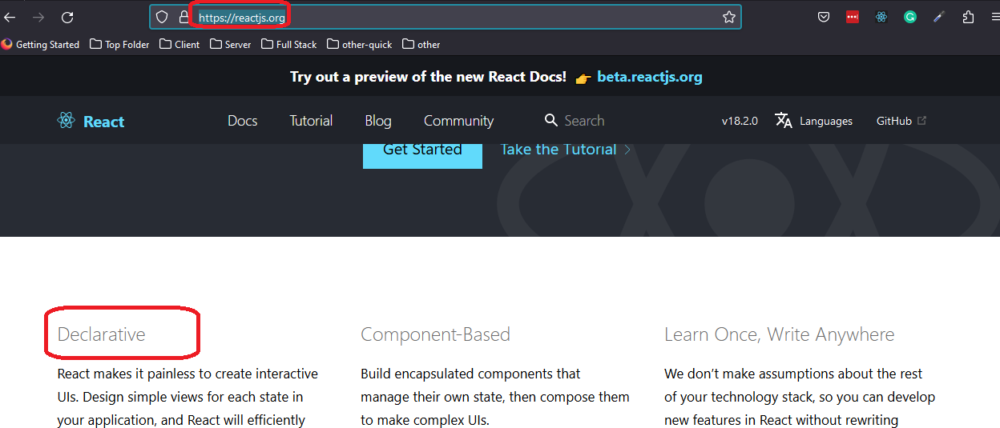

<h2>Motivation</h2>
<p>useFetchData is a custom hook that can fetch data via GET method and validate it. It return {data, isLoading, error}</p>
<p>given isLoading we might want to show progress .Given error we might want to show error .So why not do a component for this ? - thats the purpose of this repository</p>

<h2>Declerative design</h2>
What is nice about this design is that it embrace the declerative concept , which is one of react foundations



<h2>Design</h2>
The design is composed of three layers
<ul>
<li>IFetchData<DataType, QueryParamsType> - typescript interface generic</li>
<li>useFetchData<DataType, QueryParamsType> - custom hooks to fetch the data and validate it</li>
<li>GenericFetchData<DataType, QueryParamsType>(props: IFetchData<DataType>) - generic component to show : error \ success \ loading and set data to parent callback function. This component is fetching data when its url argument is set to its correct value</li>
</ul>

<h2>IFetchData</h2>

```ts
interface IFetchData<DataType, QueryParamsType> {
  url: string;
  params?: QueryParamsType;
  validate?: (data: DataType) => IValidationResult;
  setData: (data: DataType) => void;
  successComponent: ReactElement;
  errorComponent: ReactElement;
  loadingComponent: ReactElement;
}
```

<h2>using the generic fetch data component</h2>

```ts
<GenericFetchData
  setData={(_todos: any[]) => setTodos(_todos)}
  url={url}
  // --- todo nath change null to validation if required
  validate={null}
  successComponent={
    <Alert severity="success">This is an auccess alert — check it out!</Alert>
  }
  loadingComponent={
    <>
      Loading ...
      <CircularProgress />
    </>
  }
  errorComponent={
    <Alert severity="error">This is an error alert — check it out!</Alert>
  }
/>
```

<h2>Generic design</h2>
this GenericFetchData component is generic in the sense that you can 
<ul>
<li>invoke it with any GET based url</li>
<li>recive any data type</li>
<li>invoke any validation on the data</li>
<li>use any error component</li>
<li>use any loading component</li>
<li>use any success component</li>
</ul>
